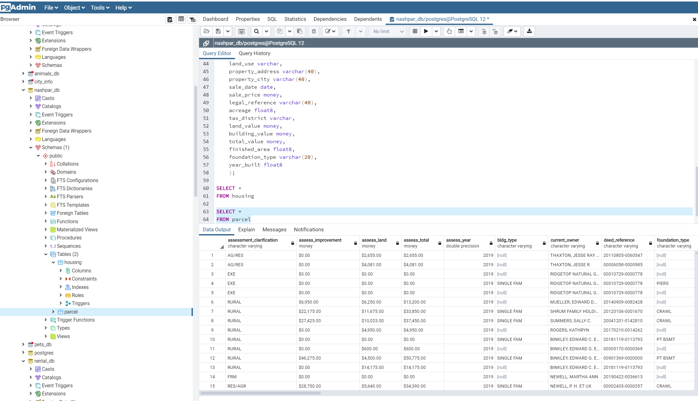

# ETL_Project
Team 8 "The Nashville Pars"

Group Members: Anastasia Valdes, Saya Uchiyama, Michael Harris, Kevin Eugene

1. [Selection of Datasets](#selection-of-datasets)
2. [Description of Datasets](#description-of-datasets)
3. [Transformation of Data](#transformation-of-data)
4. [Selection of Relationship Database Environment](#selection-of-relationship-database-environment)
4. [ERD](#erd)
5. [Loading into PostgresSQL](#loading-into-postgressql)

***

## Selection of Datasets

Source: [Nashville Land Parcels]( https://www.kaggle.com/alehe90/nashville-land-parcels)
Source: [Nashville Housing Data]( https://www.kaggle.com/tmthyjames/nashville-housing-data)

NOTE: The data files are too large to upload to GitHub. 

***

## Description of Datasets

* nashville_20190827200234.csv - this file contains data scraped from padctn.org by Drew Lehe and posted on Kaggle.com. Includes residential land parcels, multifamily units, commercial, vacant, and industrial space. Sales from 2015-July 2019 were scraped from http://www.padctn.org/services/recent-sales/ Information about each parcel of land was scraped from its "Printable Property Report Card," example: www.padctn.org/prc/property/1/card/1.
* Nashville_housing_data_2013_2016.csv - this file contains valuation data for residential homes in Nashville Tennessee. Data posted by tmthyjames, no source attributed. 

***

## Transformation of Data 
Data transformation was accomplished with jupyter using Pandas. 
* Imported Pandas and read imported csv files
* Reviewed source data
* Dropped columns that were not needed
* Reformatted column headings to be compatible with PostgresSQL (lowercase, no spaces)

***

## Selection of Relationship Database Environment

Postgres SQL server used for the database environment. 

***

## ERD

[Quickdatabasediagrams]( https://www.quickdatabasediagrams.com/) was used to generate ERD


ERD code
***
```text
housing as h
-
parcel_id varchar
land_use varchar
property_address varchar
property_city varchar
sale_date date
sale_price money
legal_reference varchar
acreage float8
tax_district varchar
land_value money
building_value money
total_value money
finished_area float8
foundation_type varchar
year_built float8

parcels as p
-
assessment_clarification varchar
assess_improvement money
assess_land money
assess_total money
assess_year float8
bldg_type varchar
current_owner varchar
deed_reference varchar
foundation_type varchar
improvement_value money
land_area varchar
land_value money
location1 varchar
map_parcel varchar
most_recent_sale_date date
most_recent_sale_price money
rooms float8
sq_footage varchar
tax_district varchar
total_appraisal_value money
year_built float8
zone1 float8
sale_date date
sale_price money
assess_improvement_improved money
recent_sale_price_improved money
improvement_value_improved money
assess_total_improved money
land_value_improved money
assess_land_improved money
total_appraisal_value_improved money
sq_footage_improved float8
custom_bldg_type varchar
land_area_acres float8
```

***

[Back to top](#etl_project)

***

## Loading into PostgresSQL

* Create a database "nashpar_db"
* Create tables with the following schema
***
```text
CREATE TABLE housing (
	parcel_id varchar,
	land_use varchar,
	property_address varchar,
	property_city varchar,
	sale_date date,
	sale_price money,
	legal_reference varchar,
	acreage float8,
	tax_district varchar,
	land_value money,
	building_value money,
	total_value money,
	finished_area float8,
	foundation_type varchar,
	year_built float8
	);

CREATE TABLE parcel (
    assessment_clarification varchar,
    assess_improvement money,
    assess_land money,
    assess_total money,
    assess_year float8,
    bldg_type varchar,
    current_owner varchar,
    deed_reference varchar,
    foundation_type varchar,
    improvement_value money,
    land_area varchar,
    land_value money,
    location1 varchar,
    map_parcel varchar,
    most_recent_sale_date date,
    most_recent_sale_price money,
    rooms float8,
    sq_footage varchar,
    tax_district varchar,
    total_appraisal_value money,
    year_built float8,
    zone1 float8,
    sale_date date,
    sale_price money,
    assess_improvement_improved money,
    recent_sale_price_improved money,
    improvement_value_improved money,
    assess_total_improved money,
    land_value_improved money,
    assess_land_improved money,
    total_appraisal_value_improved money,
    sq_footage_improved float8,
    custom_bldg_type varchar,
    land_area_acres float8
	);
```
***
## Load clean_parcels.csv file into the database


## Load clean_housing file into the database


[Back to top](#etl_project)


 